# Mind Mirror Agents Documentation

## Overview
Mind Mirror's agent system consists of specialized AI agents that work together to provide deep, personalized insights from journal entries. Each agent operates autonomously in the background, processing journal data without requiring additional user input, while the AgentOrchestrator ensures their seamless collaboration.

## Visual System Architecture

### Interactive Flow Diagram

```mermaid
graph TB
    %% Main User Node
    User((👤 User))
    
    %% Input Agents
    subgraph "Primary Data Collection"
        JA[📝 Journaling<br/>Agent]
        CA[📊 Check-in<br/>Agent]
        HT[✓ Habit Tracker<br/>Agent]
    end
    
    %% User to Input Agents
    User -->|"✍️ Journal Entries"| JA
    User -->|"💭 Well-being Data"| CA
    User -->|"📋 Habit Records"| HT
    
    subgraph "Mind Mirror Core"
        %% Orchestrator
        AO[🎯 Agent<br/>Orchestrator]
        
        %% Processing Agents
        subgraph "Specialized Analysis"
            BCA["🔄 Behavior Change<br/>Agent"]
            CTA["⭐ Catalyst<br/>Agent"]
            RA["🤔 Reflection<br/>Agent"]
            SCA["💝 Self-Compassion<br/>Agent"]
            LRS["📚 Life Reflection<br/>Synthesizer"]
        end
        
        %% Synthesis
        SI["💡 Synthesized<br/>Insights"]
    end
    
    %% Input to Orchestrator
    JA -->|"😊 Emotions & Themes"| AO
    CA -->|"📈 Well-being Metrics"| AO
    HT -->|"📊 Progress Data"| AO
    
    %% Orchestrator to Processing
    AO -->|"Distribute<br/>Data"| BCA
    AO -->|"Distribute<br/>Data"| CTA
    AO -->|"Distribute<br/>Data"| RA
    AO -->|"Distribute<br/>Data"| SCA
    AO -->|"Distribute<br/>Data"| LRS
    
    %% Processing to Synthesis
    BCA -->|"Behavior<br/>Patterns"| SI
    CTA -->|"Growth<br/>Opportunities"| SI
    RA -->|"Cognitive<br/>Analysis"| SI
    SCA -->|"Self-Talk<br/>Insights"| SI
    LRS -->|"Life<br/>Narrative"| SI
    
    %% Output
    SI -->|"🎯 Personalized Insights<br/>& Recommendations"| User
    
    %% Styling
    classDef user fill:#ff9999,stroke:#ff3333,stroke-width:3px
    classDef primary fill:#ffccff,stroke:#ff66ff,stroke-width:2px
    classDef orchestrator fill:#99ccff,stroke:#3399ff,stroke-width:2px
    classDef processor fill:#ccffcc,stroke:#66cc66,stroke-width:2px
    classDef synthesis fill:#ffffcc,stroke:#ffcc00,stroke-width:2px
    
    class User user
    class JA,CA,HT primary
    class AO orchestrator
    class BCA,CTA,RA,SCA,LRS processor
    class SI synthesis
```



### System Architecture (ASCII Visualization)

```
                                    🧠 MIND MIRROR SYSTEM 🧠
                                    
┌─────────────────────────────────── USER ───────────────────────────────────┐
│                          ⬇ Input         ⬆ Output                          │
└──────────────┬──────────────┬──────────────┬──────────────┬───────────────┘
               │              │              │              │
     📝        │     📊       │      ✓       │      💭      │
┌──────────────┴─────┐ ┌─────┴──────┐ ┌─────┴──────┐ ┌────┴─────────┐
│   Journaling       │ │  Check-in   │ │   Habit    │ │   Direct     │
│      Agent         │ │   Agent     │ │  Tracker   │ │  Feedback    │
└──────────┬─────────┘ └──────┬─────┘ └─────┬──────┘ └──────┬───────┘
           │                   │             │               │
           └───────────────────┼─────────────┼───────────────┘
                              │             │
                     ┌────────┴─────────────┴──────────┐
                     │      🎯 Agent Orchestrator       │               
                     │     (Coordination & Routing)     │
                     └───┬────────┬────────┬────────┬──┘
                         │        │        │        │
    ┌───────────────────┼────────┼────────┼────────┼───────────────────┐
    │  Specialized      │        │        │        │     Analysis       │
    │                   ▼        ▼        ▼        ▼                    │
    │          ┌─────────┐ ┌─────────┐ ┌──────┐ ┌─────────┐           │
    │          │ 🔄      │ │ ⭐      │ │ 🤔   │ │ 💝      │           │
    │          │Behavior │ │Catalyst │ │Reflect│ │ Self    │           │
    │          │Change   │ │Agent    │ │Agent  │ │Compass. │           │
    │          └────┬────┘ └────┬────┘ └───┬───┘ └────┬────┘           │
    └───────────────┼─────────┬─┴────────┬─┴─────────┼────────────────┘
                    │         │          │           │
                    └─────────┼──────────┼───────────┘
                              │          │
                        ┌─────┴──────────┴─────┐
                        │    💡 Synthesized     │
                        │       Insights        │
                        └──────────┬───────────┘
                                  │
                                  ▼
                         🎯 Final Recommendations
```

## Agent System

### Core Processing Agents

### 1. HabitTracker Agent
**Purpose**: Tracks habits and provides motivational support.
- Monitors habit completion and streaks
- Generates motivational messages
- Calculates success rates
- Suggests habit optimization strategies

### 2. CheckIn Agent
**Purpose**: Analyzes well-being metrics and provides personalized advice.
- Tracks mood, energy, and stress levels (1-10)
- Monitors sleep quality and social connection
- Analyzes trends over time
- Provides immediate, short-term, and long-term recommendations

### 3. Journaling Agent
**Purpose**: Analyzes journal entries for themes and patterns.
- Extracts key themes and topics
- Tracks emotional patterns
- Identifies recurring subjects
- Provides writing prompts and suggestions

### 4. Reflection Agent
**Purpose**: Facilitates deep self-reflection and cognitive analysis.
- Detects cognitive biases
- Generates insightful questions
- Provides reframing suggestions
- Encourages deeper introspection

### Advanced Insight Agents

### 5. Catalyst Agent
**Purpose**: Identifies breakthrough moments and opportunities for growth.
- Analyzes journal entries for significant moments and challenges
- Identifies emerging patterns and themes
- Suggests personalized growth opportunities
- Uses high reasoning effort for meaningful insights

### 2. Emotional Forecasting Agent
**Purpose**: Predicts emotional trends and provides proactive guidance.
- Analyzes historical emotional patterns
- Identifies triggers and cycles
- Generates short-term emotional forecasts
- Suggests preventive measures for emotional well-being

### 3. Behavior Change Agent
**Purpose**: Detects behavioral patterns and recommends subtle modifications.
- Identifies recurring behavioral patterns
- Detects self-limiting beliefs
- Analyzes triggers and coping mechanisms
- Suggests gentle behavior modifications

### 4. Life Reflection Synthesizer
**Purpose**: Creates a cohesive narrative from journal entries.
- Identifies key life moments and milestones
- Tracks personal growth journey
- Connects themes and patterns over time
- Suggests future directions based on past patterns

### 5. Self-Compassion Agent
**Purpose**: Promotes self-compassion through reframing.
- Identifies self-criticism and negative self-talk
- Generates compassionate reframing statements
- Provides gentle reminders for self-kindness
- Suggests practical self-compassion exercises

## Agent Orchestration

### AgentOrchestrator
**Purpose**: Coordinates agent interactions for holistic insights.

#### How It Works
1. **Data Distribution**
   - Receives journal entries
   - Distributes data to all agents
   - Manages parallel processing

2. **Insight Collection**
   - Gathers analyses from each agent
   - Ensures all perspectives are considered
   - Handles error recovery

3. **Synthesis**
   - Combines insights from all agents
   - Identifies cross-agent patterns
   - Creates cohesive recommendations

#### Agent Interactions
- **Catalyst → Emotional**: Breakthrough moments inform emotional forecasts
- **Emotional → Behavior**: Emotional patterns guide behavior modifications
- **Behavior → Life Reflection**: Behavioral insights enhance life narrative
- **Life Reflection → Self-Compassion**: Life patterns inform compassionate responses
- **Self-Compassion → Catalyst**: Compassionate framing guides growth suggestions

## Technical Implementation

### Base Agent Class
```python
class BaseAgent(BaseModel):
    """Base class for all Mind Mirror agents."""
    
    def run(self) -> Dict[str, Any]:
        """Main execution method for insights generation."""
        raise NotImplementedError
```

### Agent Configuration
All agents use the o3-mini model with:
- High reasoning effort for deep analysis
- Temperature of 0.7 for balanced creativity
- Developer role prompts for specialized expertise

### Data Flow
1. Journal entries are processed in batches
2. Each agent maintains its own analysis cache
3. The orchestrator manages data synchronization
4. Results are timestamped for tracking

### Error Handling
- Graceful degradation if an agent fails
- Comprehensive error reporting
- Automatic retry mechanisms
- Data validation at each step

## Best Practices

### Agent Development
1. Focus on background processing
2. Minimize user interaction requirements
3. Provide actionable insights
4. Maintain consistent output formats

### Integration Guidelines
1. Use the AgentOrchestrator for all multi-agent operations
2. Validate input data before processing
3. Handle errors gracefully
4. Document all agent interactions

## Future Enhancements

### Planned Features
1. Real-time insight updates
2. Enhanced pattern recognition
3. Deeper agent collaboration
4. Advanced visualization of insights

### Integration Opportunities
1. Calendar integration for context
2. External data sources
3. Customizable agent priorities
4. Enhanced reporting options

## Usage Examples

### Using Individual Agents
```python
# Using the CheckIn Agent
metrics = {
    "mood": 8,
    "energy": 7,
    "stress": 4,
    "sleep_quality": 8,
    "social_connection": 6,
    "notes": "Feeling good today"
}

agent = CheckInAgent(metrics=metrics)
results = agent.run()
```

### Using the Orchestrator
```python
# Initialize with complete journal data
journal_data = {
    "journal_entries": [...],
    "habits": [...],
    "well_being_metrics": [...]
}

orchestrator = AgentOrchestrator(journal_data=journal_data)
results = orchestrator.run()

# Access specific insights
habit_insights = results["agent_insights"]["habit_insights"]
well_being = results["agent_insights"]["well_being_insights"]
journal_analysis = results["agent_insights"]["journal_analysis"]
```

## Conclusion
The Mind Mirror agent system provides a sophisticated, automated approach to personal growth and self-reflection. Through the coordinated efforts of specialized agents and intelligent orchestration, it delivers valuable insights while maintaining a seamless user experience.
